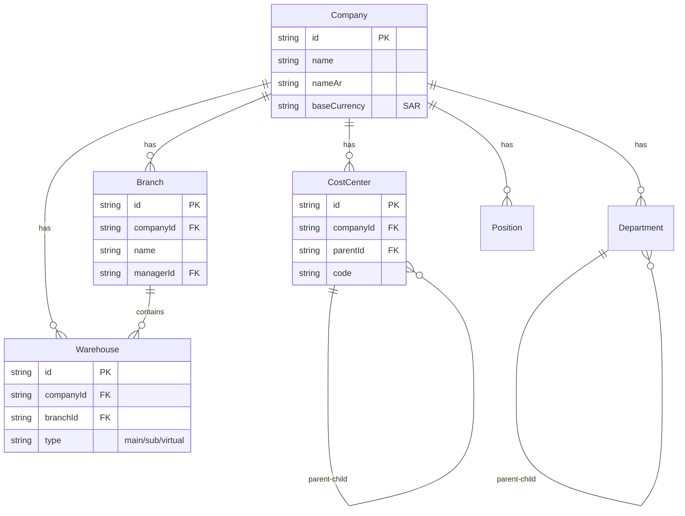
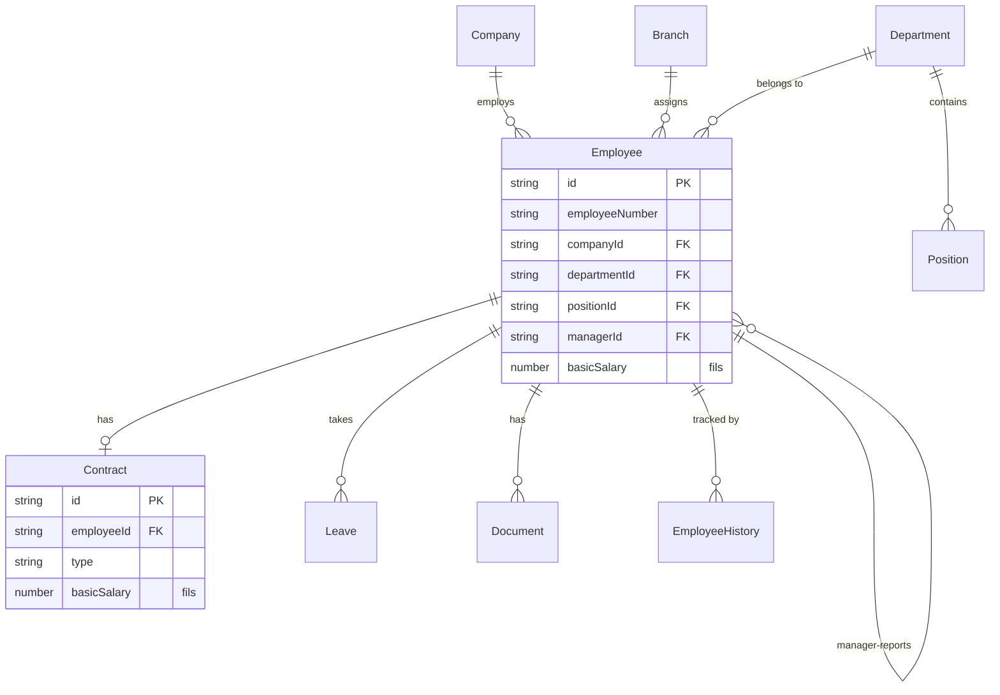
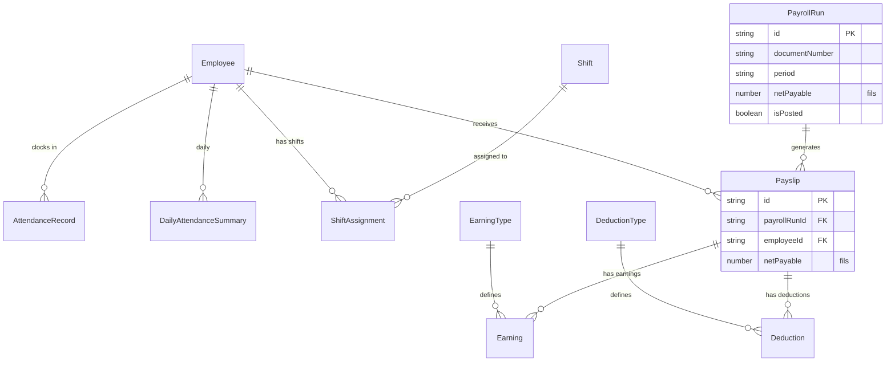
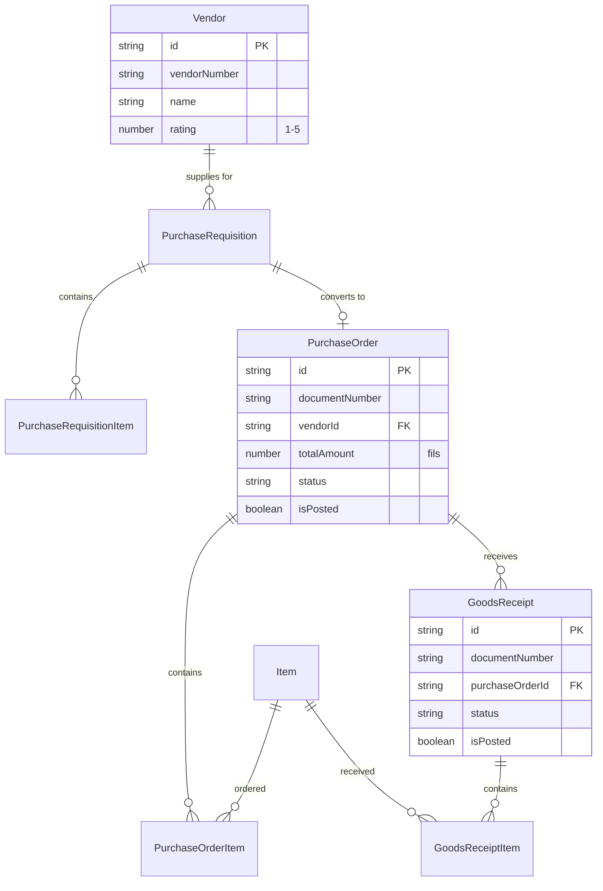
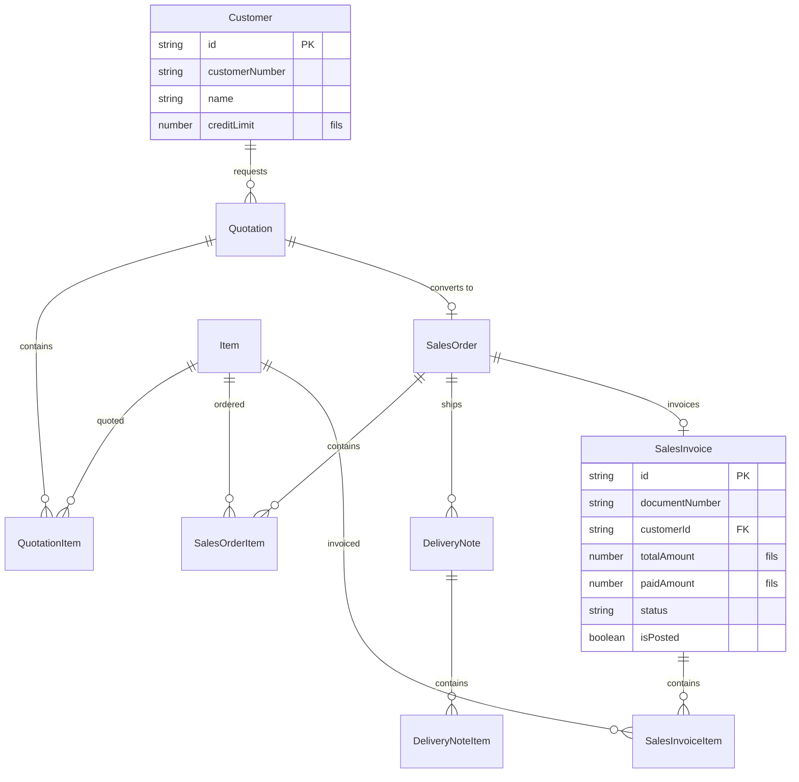
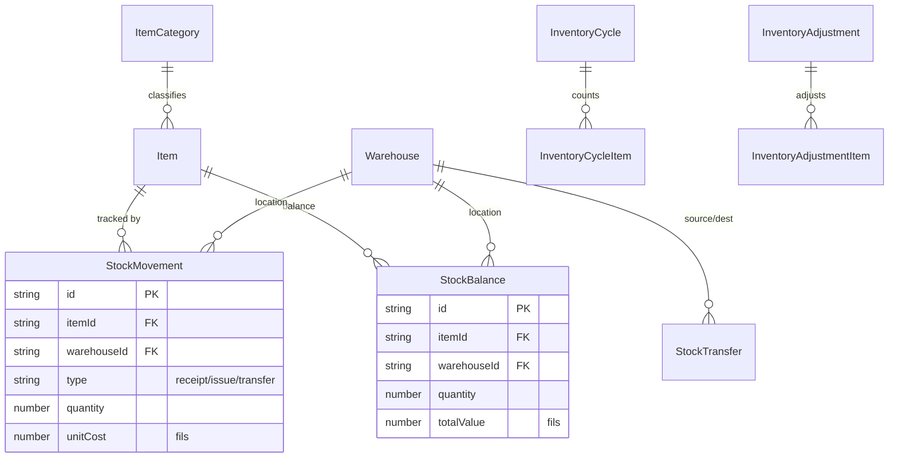
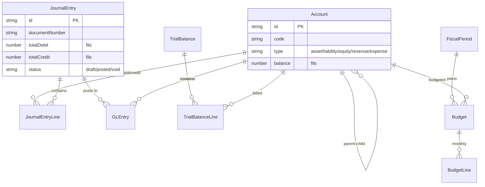
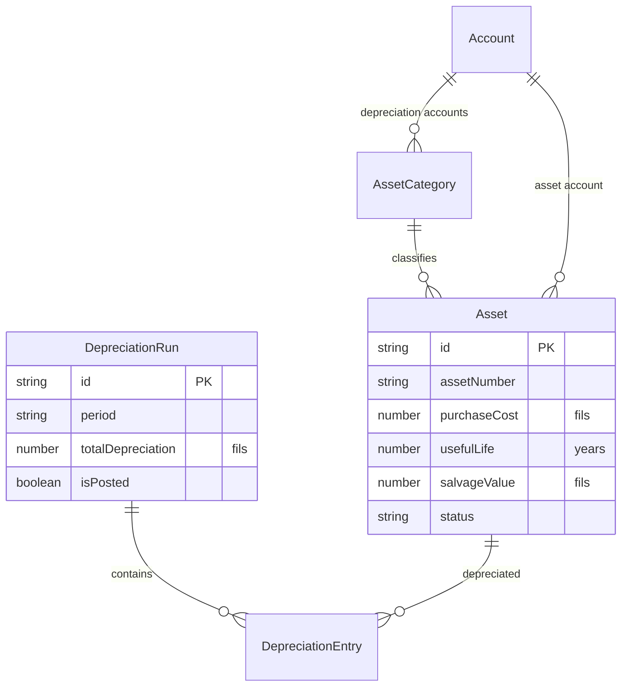
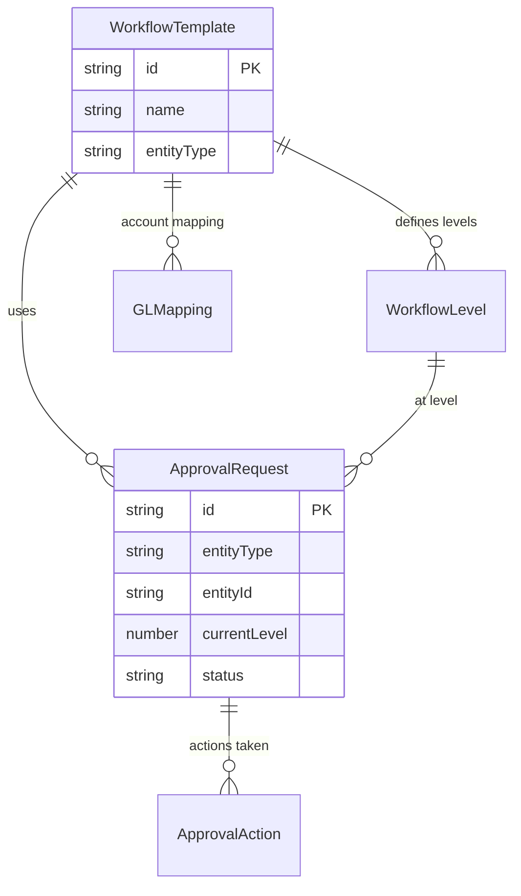
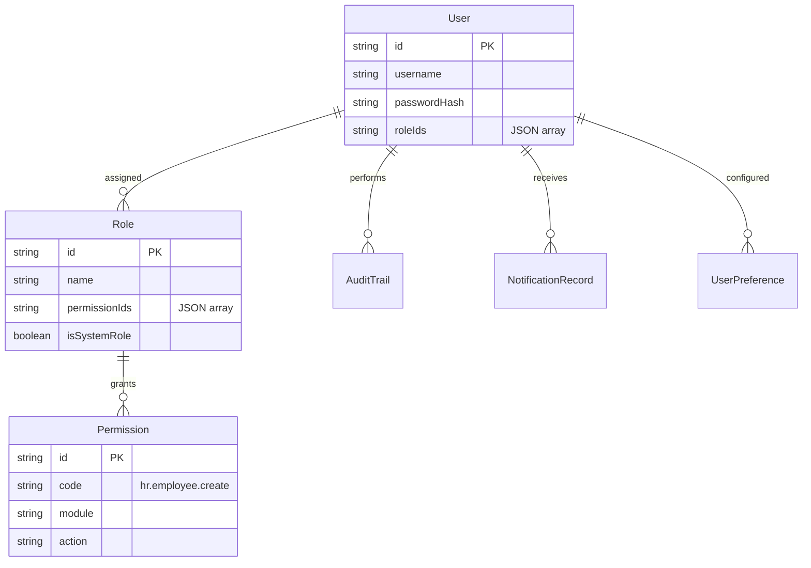

# Entity Relationship Diagrams

All relationships are implemented as **string foreign keys** (not Realm `@LinkedObjects` decorators). The application resolves relationships through service/repository calls.

## 1. Core Organization Structure

## 2. Employee & HR Structure

## 3. Attendance & Payroll

## 4. Procure-to-Pay Cycle

## 5. Order-to-Cash Cycle

## 6. Inventory Management

## 7. Accounting & Financial

## 8. Assets & Depreciation

## 9. Workflow & Approvals

## 10. Security & User Management

